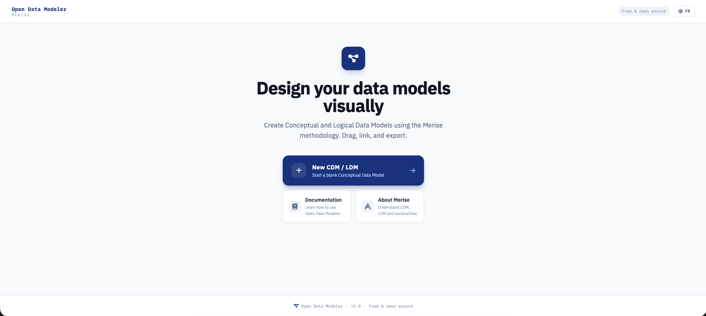
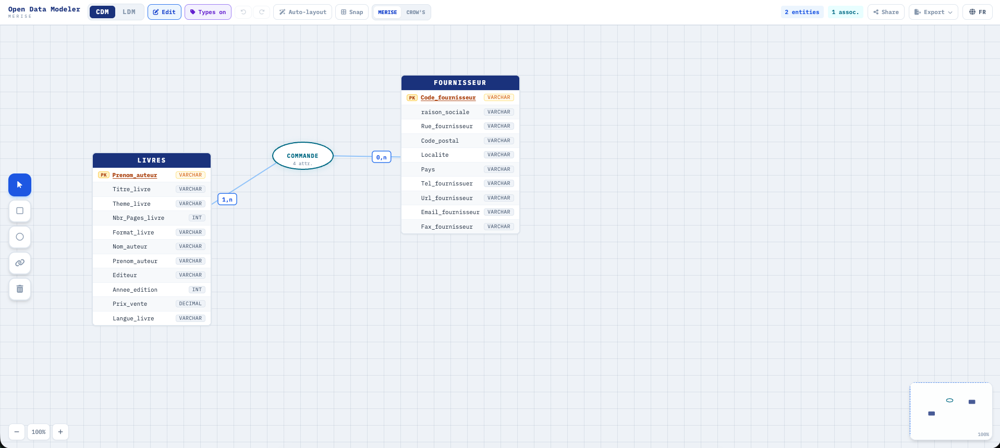

# Open Data Modeler

**Open Data Modeler** is a free, open-source web application for designing relational database schemas visually using the **Merise** methodology. Create Conceptual Data Models (CDM) and Logical Data Models (LDM), then export them as PNG, PDF, or SQL.





---

## Table of Contents

1. [Installation](#installation)
2. [Getting Started](#getting-started)
3. [The Editor](#the-editor)
   - [Toolbar](#toolbar)
   - [CDM Mode — Conceptual Data Model](#cdm-mode)
   - [LDM Mode — Logical Data Model](#ldm-mode)
   - [Keyboard Shortcuts](#keyboard-shortcuts)
4. [Working with Entities](#working-with-entities)
5. [Working with Associations](#working-with-associations)
6. [The LDM Column Editor](#the-ldm-column-editor)
7. [Export & Import](#export--import)
8. [Projects](#projects)
9. [Language](#language)
10. [Merise Quick Reference](#merise-quick-reference)
11. [Project Structure](#project-structure)

---

## Installation

### Requirements

- **Node.js** ≥ 18
- **npm** ≥ 9

### Steps

```bash
# 1. Clone or unzip the project
cd open-data-modeler

# 2. Install dependencies
npm install

# 3. Start the development server
npm run dev
```

The app is available at **http://localhost:3000**.

### Production Build

```bash
npm run build      # Server-side rendering build
npm run generate   # Static site (no server required)
npm run preview    # Preview the production build locally
```

---

## Getting Started

Open `http://localhost:3000`. You will land on the **home page**, which shows:

- A **"New CDM / LDM"** button — creates a blank diagram and opens the editor
- **Recent diagrams** — previously saved diagrams loaded from your browser's local storage
- Links to **Documentation** and **About Merise**

Click **New CDM / LDM** to open a blank editor.

> **Auto-save:** The editor automatically saves your work to `localStorage` every time you make a change. Your diagram is restored the next time you open the editor.

---

## The Editor

The editor has two modes, toggled from the toolbar:

| Mode                  | Label   | Purpose                                     |
| --------------------- | ------- | ------------------------------------------- |
| Conceptual Data Model | **CDM** | Visual canvas for entities and associations |
| Logical Data Model    | **LDM** | Relational table view, independent from CDM |

### Toolbar

The toolbar runs across the top of the editor.

#### Left section

| Control                      | Description                                                               |
| ---------------------------- | ------------------------------------------------------------------------- |
| **Open Data Modeler** (logo) | Click to return to the home page                                          |
| **CDM / LDM** toggle         | Switch between the two model views                                        |
| **Edit / View**              | Toggle edit mode on the CDM canvas                                        |
| **Types on/off**             | Show or hide attribute type badges on entity nodes                        |
| **↩ / ↪** (Undo / Redo)      | Step through change history                                               |
| **Auto-layout**              | Automatically arrange all nodes to reduce overlaps                        |
| **Snap**                     | Snap node positions to a 20px grid                                        |
| **Merise / Crow's**          | Switch cardinality notation between Merise badges and Crow's Foot markers |

#### Right section

| Control                      | Description                                                               |
| ---------------------------- | ------------------------------------------------------------------------- |
| **Entity / Assoc. counters** | Live count of CDM nodes                                                   |
| **Share**                    | Generate a shareable URL that encodes the diagram                         |
| **Export ▾**                 | Dropdown with all export options (see [Export & Import](#export--import)) |
| **🌐 EN / FR**               | Switch interface language                                                 |

---

## CDM Mode

The CDM canvas is where you build your conceptual schema.

### Edit vs View mode

The toolbar **Edit / View** button controls whether you can modify the diagram:

- **View mode** (default) — read-only; you can pan and zoom but cannot add or move nodes
- **Edit mode** — shows the floating tool palette; all editing actions are available

### Floating Tool Palette

When **Edit mode** is active, a vertical palette appears on the left edge of the canvas. Each button has a tooltip that appears on hover.

| Icon | Tool            | Action                                                                             |
| ---- | --------------- | ---------------------------------------------------------------------------------- |
| ↖    | **Select**      | Click to select a node; drag to move it; `Shift+click` to multi-select             |
| □    | **Entity**      | Click anywhere on the canvas to create a new entity                                |
| ◯    | **Association** | Click anywhere on the canvas to create a new association                           |
| ↔    | **Link**        | Click an entity, then an association (or vice versa) to create a link between them |
| 🗑   | **Delete**      | Click any node to delete it                                                        |

### Creating an Entity

1. Switch to **Edit mode**
2. Select the **Entity** tool (□)
3. Click anywhere on the canvas — an entity named `ENTITY` appears at that position
4. The entity is automatically selected; the right-hand sidebar opens for editing

### Creating an Association

1. Select the **Association** tool (◯)
2. Click anywhere on the canvas — an oval named `ASSOC` appears
3. Use the **Link** tool to connect it to entities

### Linking an Entity to an Association

1. Select the **Link** tool (↔)
2. Click an **entity** — a yellow hint banner appears at the top: _"Click on an association"_
3. Click an **association** — a link is created with a default cardinality of `1,n`

You can also start by clicking the association first, then the entity.

To cancel a pending link, click the **×** in the yellow banner.

### Moving Nodes

In **Edit mode** with the **Select** tool active, drag any entity or association to reposition it. The canvas also supports:

- **Mouse wheel** — zoom in/out (centered on the cursor position)
- **Middle-click + drag** — pan the canvas
- **Zoom controls** (bottom-left of canvas) — `−`, percentage label (click to reset to 100%), `+`

### Multi-select

- `Shift+click` individual nodes to add them to the selection
- **Click+drag** on empty canvas space to draw a rubber-band selection box

### Double-click to Rename

In Edit mode, double-click directly on an entity header or an association oval to rename it inline. Press `Enter` to confirm or `Escape` to cancel.

### Minimap

A small overview panel in the bottom-right corner shows the full diagram with a blue rectangle indicating the current viewport. Useful for large diagrams.

### Validation Warnings

Amber warning banners appear at the bottom of the canvas when:

- An entity has **no primary key** attribute
- An association has **fewer than 2 links**

---

## LDM Mode

The LDM view is **independent** from the CDM. It starts empty when you create a new diagram.

### Generating the LDM

Click **Sync from CDM** (in the toolbar or the empty-state button) to auto-generate relational tables from your CDM:

- Each **entity** becomes a table with the same columns
- **1:n associations** — a foreign key is migrated into the "one" side table
- **n:n associations** — a junction table is created with two foreign keys plus any association attributes

> **Important:** Syncing overwrites the current LDM completely. All manual edits (column renames, type changes, PK/FK assignments) will be lost.

### Navigating the LDM

The LDM canvas behaves similarly to the CDM:

- **Drag** table headers to reposition tables
- **SVG relation lines** (dashed) connect FK columns to their referenced tables

### Edit Mode in LDM

Toggle **Edit / Read-only** in the LDM toolbar to enable editing. When active:

- Click any column row to open the **Column Editor panel** on the right

---

## Working with Entities

Click an entity in **Edit mode** to open its editor in the right sidebar.

| Field               | Description                                                  |
| ------------------- | ------------------------------------------------------------ |
| **Entity name**     | Automatically uppercased                                     |
| **Header color**    | Choose from 8 preset colors for the entity header            |
| **Attributes**      | List of columns with name, type, and primary key flag        |
| **+ Add attribute** | Adds a new attribute row                                     |
| **× per attribute** | Removes that attribute                                       |
| **Delete entity**   | Permanently removes the entity and all its association links |

### Attribute Types

`AUTOINCREMENT` · `INT` · `BIGINT` · `VARCHAR` · `TEXT` · `DATE` · `BOOLEAN` · `FLOAT` · `DECIMAL` · `UUID`

> **Tip:** `AUTOINCREMENT` is the recommended type for primary key IDs. It maps to `SERIAL` in PostgreSQL, `INT AUTO_INCREMENT` in MySQL, and `INTEGER PRIMARY KEY AUTOINCREMENT` in SQLite.

---

## Working with Associations

Click an association (oval) in **Edit mode** to open its editor.

| Field                  | Description                                                                     |
| ---------------------- | ------------------------------------------------------------------------------- |
| **Association name**   | Automatically uppercased                                                        |
| **Cardinalities**      | Per-link cardinality selector (`0,1` / `1,1` / `0,n` / `1,n`)                   |
| **× per link**         | Removes that link                                                               |
| **Attributes**         | Associations can carry their own attributes (e.g., `quantity` on an ORDER line) |
| **Delete association** | Permanently removes the association                                             |

### Cardinality Notation

Switch between **Merise** (numeric badges on lines) and **Crow's Foot** (graphical markers at entity ends) using the notation toggle in the toolbar.

---

## The LDM Column Editor

Click any column in the LDM **Edit mode** to open the column editor panel.

| Field                | Description                                                        |
| -------------------- | ------------------------------------------------------------------ |
| **Column name**      | Rename the column                                                  |
| **Column type**      | Change the SQL type                                                |
| **Key role**         | Toggle **PK** and **FK** independently                             |
| **PK** (amber)       | Marks the column as primary key. Automatically clears FK if active |
| **FK** (orange)      | Marks the column as foreign key. Automatically clears PK if active |
| **× clear**          | Removes both key designations (regular column)                     |
| **References table** | When FK is active, select which table this column references       |

Changes are stored as **overrides** layered on top of the generated schema. Click **Reset edits** in the toolbar to revert all overrides back to the last sync.

---

## Export & Import

All export options are in the **Export ▾** dropdown in the top-right of the toolbar.

| Option          | Description                                                           |
| --------------- | --------------------------------------------------------------------- |
| **Export JSON** | Downloads `diagram.json` — the full diagram (CDM + LDM + overrides)   |
| **Import JSON** | Opens a file picker to load a previously exported JSON file           |
| **Export PNG**  | Captures the current view as a high-resolution PNG (2× pixel density) |
| **Export PDF**  | Captures the current view as a PDF (auto-orientation)                 |
| **Export SQL**  | Opens a modal with a DDL script generated from the LDM                |

### SQL Export

The SQL modal includes a **dialect selector**:

| Dialect        | Notes                                                 |
| -------------- | ----------------------------------------------------- |
| **PostgreSQL** | `AUTOINCREMENT` → `SERIAL`                            |
| **MySQL**      | `AUTOINCREMENT` → `INT AUTO_INCREMENT`                |
| **SQLite**     | `AUTOINCREMENT` → `INTEGER PRIMARY KEY AUTOINCREMENT` |

You can **Copy** the script to clipboard or **Download** it as a `.sql` file.

### Share

Click the **Share** button to generate a URL that encodes the current diagram as a compressed Base64 query parameter. Anyone with the link can open the same diagram in their browser — no account required.

---

## Projects

The home page lists your recent diagrams stored in `localStorage`.

| Action     | How                                                |
| ---------- | -------------------------------------------------- |
| **Open**   | Click the blue **Open** button next to a project   |
| **Rename** | Click the pen icon, type a new name, press `Enter` |
| **Delete** | Click the trash icon                               |

The editor auto-saves the active diagram to a dedicated `odm_autosave` key in `localStorage` every time you make a change.

---

## Keyboard Shortcuts

These shortcuts work when the canvas is focused (click the canvas area first).

| Shortcut                  | Action                     |
| ------------------------- | -------------------------- |
| `Ctrl+Z` / `Cmd+Z`        | Undo                       |
| `Ctrl+Shift+Z` / `Ctrl+Y` | Redo                       |
| `Delete` / `Backspace`    | Delete selected node(s)    |
| `Escape`                  | Deselect all               |
| `E`                       | Switch to Entity tool      |
| `A`                       | Switch to Association tool |
| `L`                       | Switch to Link tool        |
| `D`                       | Switch to Delete tool      |
| `S`                       | Switch to Select tool      |

> Shortcuts `E`, `A`, `L`, `D`, `S` only work in **Edit mode**.

---

## Language

Click the **🌐 EN / FR** button in the top-right to toggle between English and French. The choice is saved in `localStorage` and persists across sessions.

In French mode:

- CDM → **MCD** (Modèle Conceptuel de Données)
- LDM → **MLD** (Modèle Logique de Données)

---

## Merise Quick Reference

Merise is a French data and systems modelling methodology. It separates design into two levels:

### Entities

An entity represents a real-world object (e.g., `CLIENT`, `PRODUCT`). Each entity has attributes, one of which is the **primary key (PK)** — the unique identifier.

### Associations

An association represents a relationship between entities (e.g., `PLACES` between CLIENT and ORDER). Associations can carry their own attributes.

### Cardinalities

| Notation | Meaning                           |
| -------- | --------------------------------- |
| `0,1`    | Zero or one — optional, unique    |
| `1,1`    | Exactly one — mandatory, unique   |
| `0,n`    | Zero or many — optional, multiple |
| `1,n`    | One or many — mandatory, multiple |

### CDM → LDM Conversion Rules

| CDM pattern     | LDM result                                                     |
| --------------- | -------------------------------------------------------------- |
| Each entity     | One table with the same columns                                |
| 1:n association | FK migrated into the "one" side table                          |
| n:n association | New junction table with two FKs + association's own attributes |

---

## Project Structure

```
open-data-modeler/
├── app.vue                        # Root component — sets <html lang> reactively
├── assets/css/main.css            # Tailwind directives + shared CSS component classes
│
├── components/
│   ├── ui/
│   │   ├── HdrBtn.vue             # Reusable toolbar button (active/disabled states)
│   │   └── DropItem.vue           # Dropdown menu item (icon + label + subtitle)
│   ├── AssocNode.vue              # Association oval node (draggable, inline rename)
│   ├── CrowsFoot.vue              # SVG Crow's Foot cardinality marker
│   ├── EntityNode.vue             # Entity card node (draggable, color, validation dot)
│   ├── LangSwitcher.vue           # EN / FR toggle button
│   ├── McdCanvas.vue              # CDM interactive canvas (zoom, pan, palette, minimap)
│   ├── MiniMap.vue                # Minimap overview panel
│   ├── MldView.vue                # LDM diagram canvas (independent tables, sync button)
│   ├── SvgConnections.vue         # SVG lines and cardinality badges between CDM nodes
│   ├── TheHeader.vue              # Main toolbar
│   ├── TheSidebar.vue             # Context sidebar (entity/association editor)
│   ├── ValidationPanel.vue        # Amber validation warning banners
│   └── sidebar/
│       ├── EntityEditor.vue       # Entity name, color, attributes form
│       └── AssocEditor.vue        # Association name, cardinalities, attributes form
│
├── composables/
│   ├── useCanvas.ts               # Pan, zoom, drag, rubber-band selection
│   ├── useDiagram.ts              # Central state: CDM + independent LDM + history
│   ├── useExport.ts               # PNG/PDF export via html2canvas + jsPDF
│   ├── useJsonIO.ts               # JSON file download and import via file picker
│   ├── useLocale.ts               # Custom i18n (EN + FR, no external dependency)
│   └── useProjects.ts             # Named diagram persistence in localStorage
│
├── pages/
│   ├── index.vue                  # Home page with recent projects
│   ├── editor.vue                 # Main diagram editor
│   ├── docs.vue                   # Documentation page
│   └── about.vue                  # About Merise page
│
├── types/index.ts                 # All TypeScript interfaces
│
├── utils/
│   ├── layout.ts                  # Auto-layout grid algorithm
│   ├── mld.ts                     # CDM → LDM conversion algorithm
│   ├── sql.ts                     # SQL DDL generator (PostgreSQL, MySQL, SQLite)
│   └── uid.ts                     # ID generator, ATTR_TYPES, CARD_OPTIONS constants
│
├── nuxt.config.ts                 # Nuxt 3 config (Tailwind via PostCSS, no external modules)
├── tailwind.config.ts             # Tailwind content paths and font families
└── package.json                   # nuxt@^3.13.2, tailwindcss@^3.4, autoprefixer
```

### Key Design Decisions

- **No i18n module** — translations are a typed flat-key object in `useLocale.ts`, no runtime dependency
- **No Tailwind module** — Tailwind runs as a plain PostCSS plugin, eliminating module conflicts
- **No external state library** — all state lives in Vue `ref`/`computed` inside composables
- **Independent CDM and LDM** — changes to one do not automatically affect the other; sync is explicit
- **Undo/Redo** — 50-step history stored as JSON snapshots inside `useDiagram`
